<p align="center">
  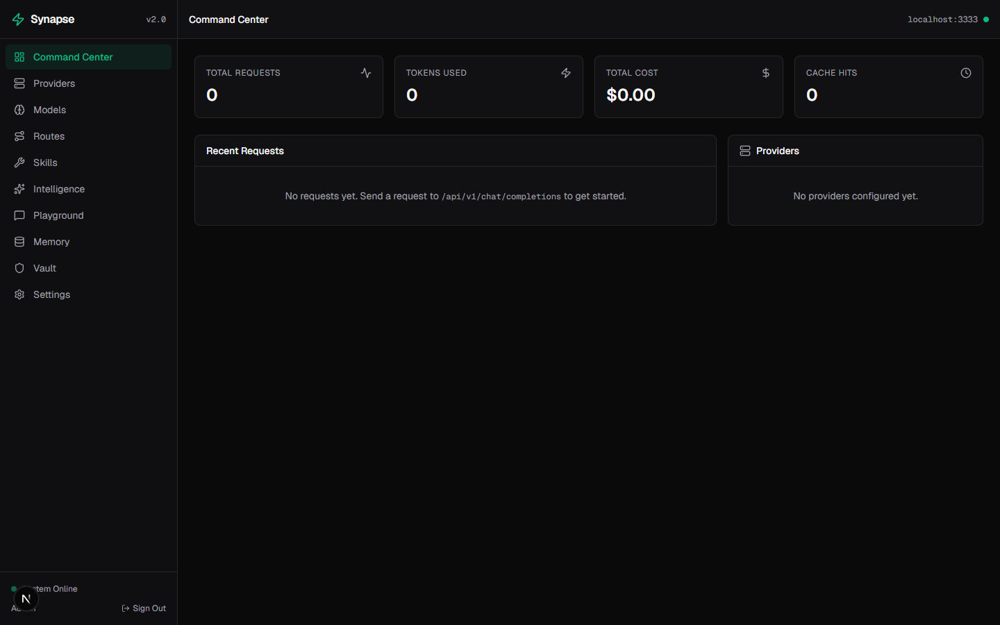
</p>

<h1 align="center">⚡ Synapse — AI Gateway & Intelligence Platform</h1>

<p align="center">
  <strong>The neural hub for all your AI providers.</strong><br>
  Route requests intelligently, cache semantically, compress tokens, learn from experience, and manage 5+ AI providers through a single beautiful dashboard.
</p>

<p align="center">
  
  
  
  
  
</p>

<p align="center">
  <a href="#-quick-start">Quick Start</a> •
  <a href="#-21-breakthrough-features">Features</a> •
  <a href="#-screenshots">Screenshots</a> •
  <a href="#-api-reference">API</a> •
  <a href="#-tech-stack">Tech Stack</a>
</p>

---

## 📸 Screenshots

### Authentication

<p align="center">
  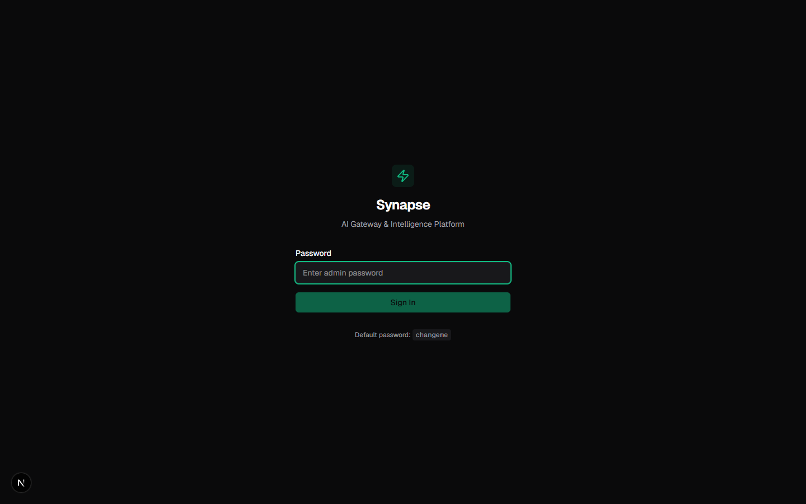
</p>

### Dashboard — All 10 Pages

<table>
  <tr>
    <td align="center"><b>📊 Command Center</b></td>
    <td align="center"><b>🔌 Providers</b></td>
  </tr>
  <tr>
    <td></td>
    <td>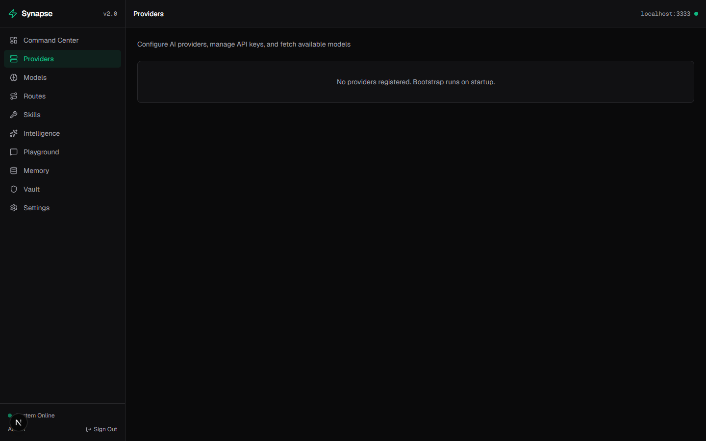</td>
  </tr>
  <tr>
    <td align="center"><b>🧠 Models</b></td>
    <td align="center"><b>🔀 Routes</b></td>
  </tr>
  <tr>
    <td>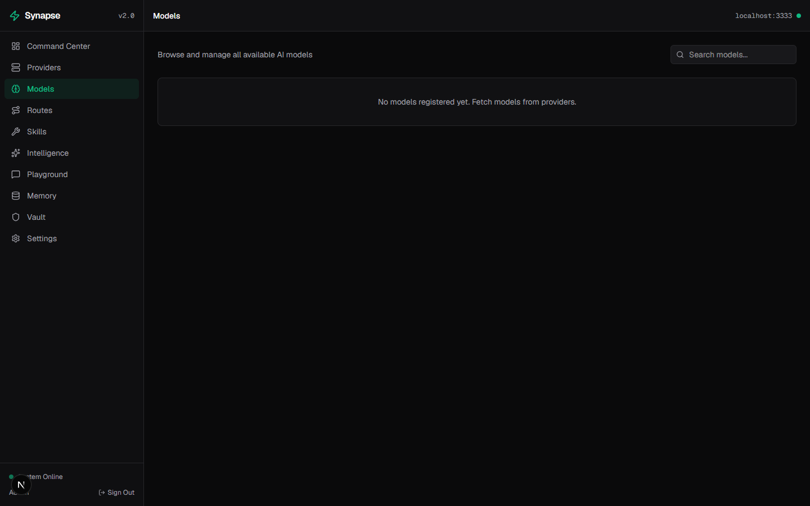</td>
    <td>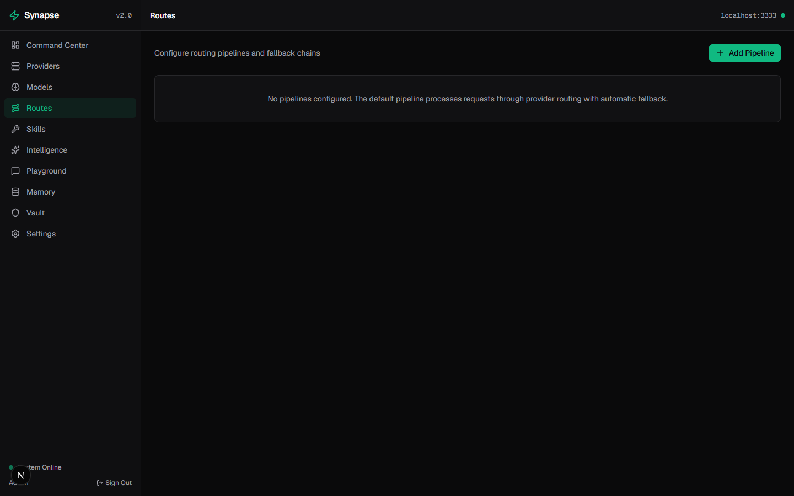</td>
  </tr>
  <tr>
    <td align="center"><b>🛠️ Skills</b></td>
    <td align="center"><b>✨ Intelligence</b></td>
  </tr>
  <tr>
    <td>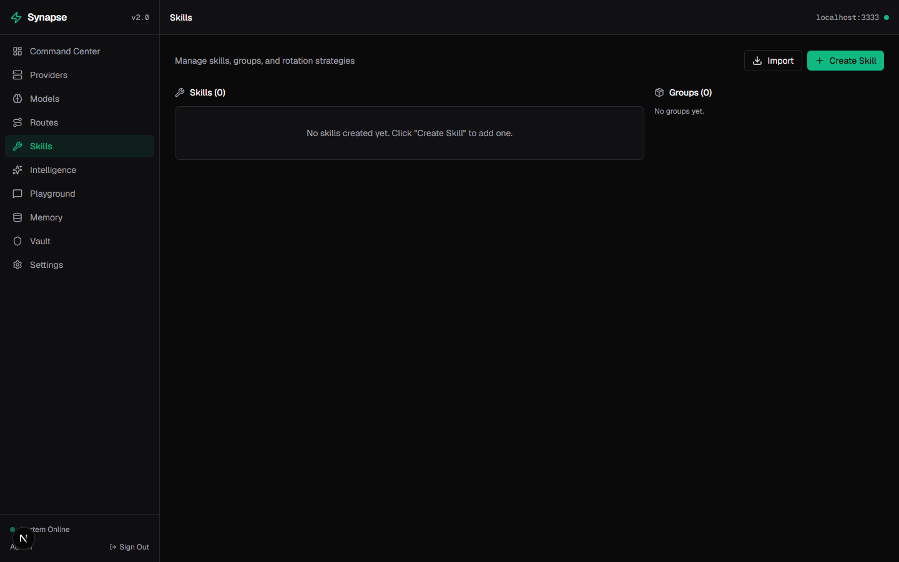</td>
    <td>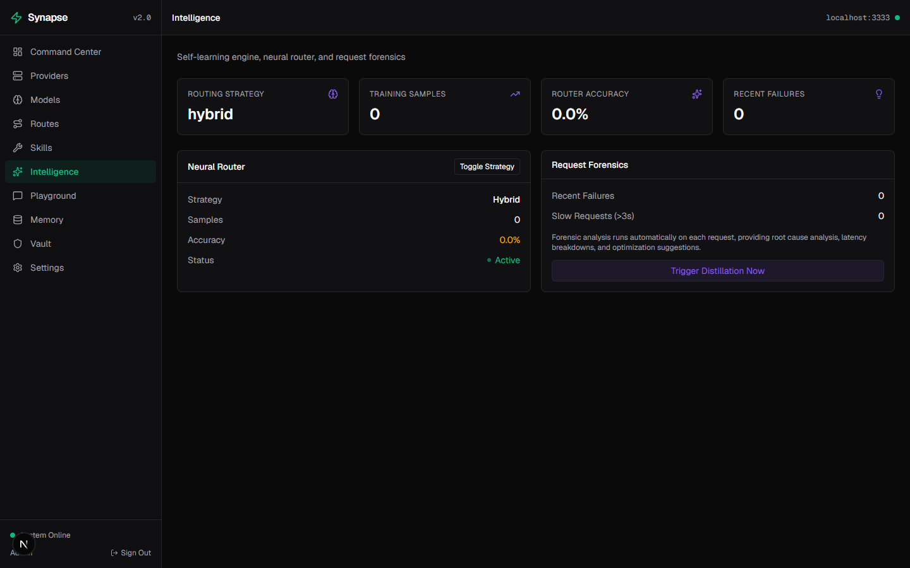</td>
  </tr>
  <tr>
    <td align="center"><b>💬 Playground</b></td>
    <td align="center"><b>💾 Memory</b></td>
  </tr>
  <tr>
    <td>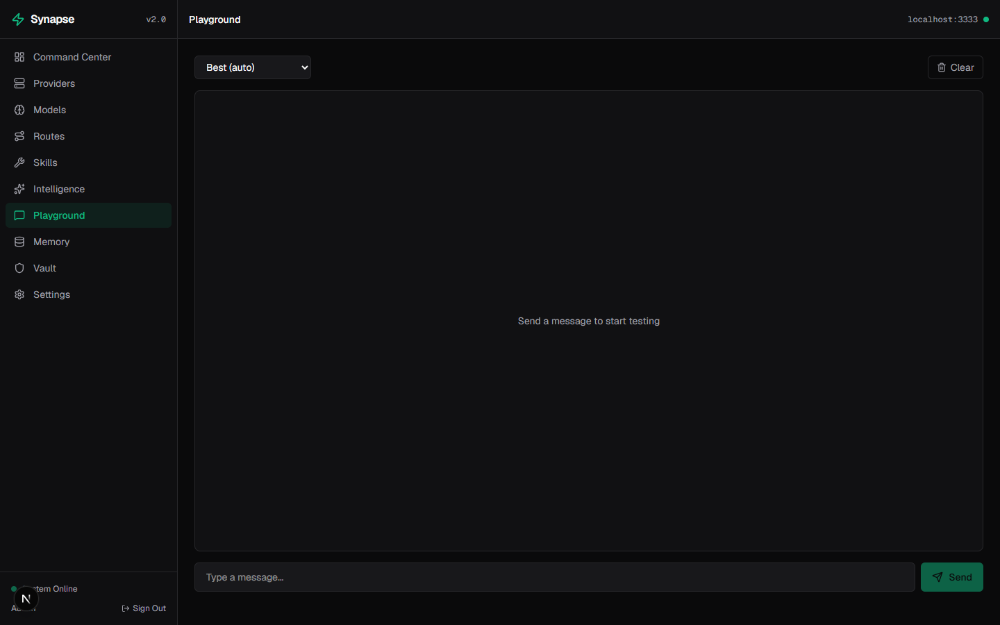</td>
    <td>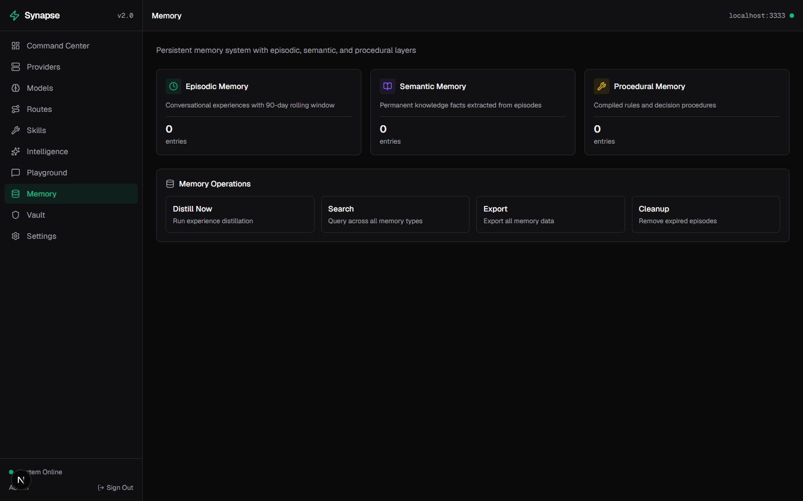</td>
  </tr>
  <tr>
    <td align="center"><b>🔐 Vault</b></td>
    <td align="center"><b>⚙️ Settings</b></td>
  </tr>
  <tr>
    <td>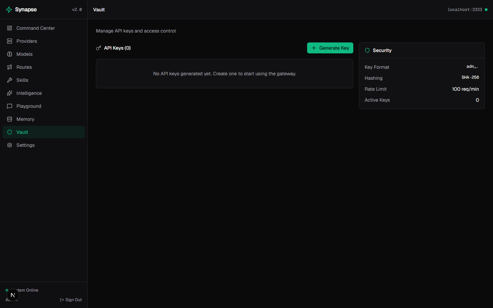</td>
    <td>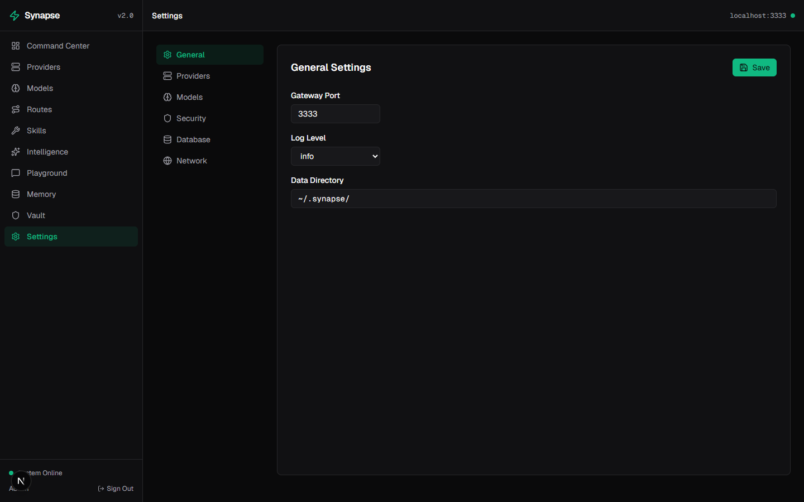</td>
  </tr>
</table>

---

## 🧠 21 Breakthrough Features

| # | Feature | Description |
|---|---------|-------------|
| 1 | **Neural Router** | AI-powered request routing with 5 strategies (priority, latency, cost, round-robin, hybrid) |
| 2 | **Semantic Cache** | LRU + SQLite persisted cache with SHA-256 hashing and TTL expiry |
| 3 | **Adaptive Token Squeezer** | 4 compression levels (none → aggressive), auto-classifies code vs text |
| 4 | **Persistent Memory** | 3-layer store: Episodic (90-day), Semantic (permanent), Procedural (rules) |
| 5 | **Self-Learning (Distiller)** | Runs every 6h, extracts patterns, generates rules from request history |
| 6 | **Dynamic Skill Rotation** | 5 strategies: round-robin, quality-based, weighted-random, task-match, schedule |
| 7 | **Skill Forge** | Create skills from recipes, import from OpenClaw format |
| 8 | **Universal Namespace** | 8 aliases (`best`, `fast`, `cheap`, `code`, `reason`...) + auto task detection |
| 9 | **Predictive Cost Engine** | Monthly forecast, budget manager, model cost comparison |
| 10 | **Provider Health Monitor** | Tracks latency, error rate, consecutive failures every 5 minutes |
| 11 | **Request Forensics** | Timeline, root cause analysis, latency breakdown, optimization suggestions |
| 12 | **MCP Gateway** | Model Context Protocol server with 6 tools + 2 resources |
| 13 | **Plugin System** | Pre/post request hooks with PII redactor + response validator built-in |
| 14 | **Benchmark Engine** | Shadow testing, quality scoring, A/B model comparison |
| 15 | **Pipeline Builder** | 11 node types, visual pipeline construction |
| 16 | **Format Translation** | Bidirectional converters for OpenAI, Anthropic, Gemini |
| 17 | **Fallback Engine** | Candidate ranking, exponential backoff, timeout management |
| 18 | **Auth System** | JWT login + API key management (`syn_` prefixed keys, SHA-256 hashed) |
| 19 | **Analytics Aggregator** | Usage stats, 30-day time series, top models, provider performance |
| 20 | **Provider Management** | 5 adapters (OpenAI, Anthropic, Gemini, DeepSeek, OpenRouter) |
| 21 | **Real-time Dashboard** | 10 pages with live data, SSE streaming, auto-refresh |

---

## 🏗️ Architecture

```
synapse/
├── src/
│   ├── app/
│   │   ├── api/                  # 42 API Routes
│   │   │   ├── v1/               # OpenAI-compatible endpoints
│   │   │   │   ├── chat/completions
│   │   │   │   └── models
│   │   │   ├── providers/        # Provider + account management
│   │   │   ├── models/           # Model registry + benchmark
│   │   │   ├── skills/           # Skill CRUD + rotation
│   │   │   ├── memory/           # 3-layer memory store
│   │   │   ├── cache/            # Semantic cache stats
│   │   │   ├── intelligence/     # Neural router + forensics
│   │   │   ├── analytics/        # Usage + cost analytics
│   │   │   ├── auth/             # JWT login
│   │   │   ├── keys/             # API key management
│   │   │   ├── mcp/              # MCP gateway
│   │   │   ├── namespace/        # Universal model aliases
│   │   │   ├── plugins/          # Plugin management
│   │   │   ├── routes/pipeline/  # Pipeline builder
│   │   │   ├── settings/         # App configuration
│   │   │   ├── dashboard/        # Dashboard data
│   │   │   ├── distill/          # Experience distiller
│   │   │   └── events/           # SSE stream
│   │   ├── dashboard/            # 10 Dashboard Pages
│   │   │   ├── page.tsx          # Command Center
│   │   │   ├── providers/        # Provider management
│   │   │   ├── models/           # Model browser
│   │   │   ├── routes/           # Pipeline routes
│   │   │   ├── skills/           # Skill management
│   │   │   ├── intelligence/     # Neural router + forensics
│   │   │   ├── playground/       # SSE streaming chat
│   │   │   ├── memory/           # 3-layer memory
│   │   │   ├── vault/            # API keys
│   │   │   └── settings/         # Configuration
│   │   └── login/                # Auth page
│   ├── lib/
│   │   ├── providers/            # 5 Provider Adapters
│   │   ├── router/               # Core request router
│   │   ├── fallback/             # Fallback engine
│   │   ├── format/               # Format translators
│   │   ├── cache/                # Semantic cache
│   │   ├── memory/               # Persistent memory
│   │   ├── skills/               # Skill system
│   │   ├── neural/               # Neural router
│   │   ├── squeezer/             # Token compression
│   │   ├── prediction/           # Cost forecasting
│   │   ├── health/               # Health checker
│   │   ├── namespace/            # Universal namespace
│   │   ├── benchmark/            # Model benchmark
│   │   ├── pipeline/             # Pipeline builder
│   │   ├── mcp/                  # MCP gateway
│   │   ├── plugins/              # Plugin system
│   │   ├── forensics/            # Request forensics
│   │   ├── distiller/            # Experience distiller
│   │   ├── analytics/            # Analytics aggregator
│   │   ├── auth/                 # JWT + API keys
│   │   ├── db/                   # SQLite + Drizzle ORM (21 tables)
│   │   └── config/               # Zod schema config
│   └── components/ui/            # Reusable UI components
├── e2e/                          # Playwright E2E tests
├── docs/                         # PRD + Implementation Plan
└── screenshots/                  # README screenshots
```

---

## 🚀 Quick Start

### Prerequisites
- **Node.js** 20+
- **npm**

### Install & Run

```bash
git clone https://github.com/kevindoni/Synapse.git
cd Synapse
npm install
npm run dev
```

Open **http://localhost:3000** → login with password `changeme`.

### Connect AI Providers

1. Login → open **Providers** in the sidebar
2. Click **Manage** on a provider (e.g., OpenAI)
3. Click **Add Account** → paste your API key
4. Click **Fetch Models** to populate the model list
5. Start chatting in the **Playground**

### Production Build

```bash
npm run build
npm start
```

---

## 🔌 Supported Providers

| Provider | Prefix | Models |
|----------|--------|--------|
| **OpenAI** | `oa/` | GPT-4o, GPT-4o-mini, o3, o3-mini |
| **Anthropic** | `an/` | Claude Sonnet 4, Claude Opus 4.7, Claude Haiku 3.5 |
| **Google Gemini** | `gm/` | Gemini 2.5 Pro, Gemini 2.5 Flash |
| **DeepSeek** | `ds/` | DeepSeek Chat, DeepSeek Reasoner |
| **OpenRouter** | `or/` | 200+ models via single API |

---

## 🧪 Testing

```bash
npm test            # Unit tests (46 tests — Vitest)
npm run test:e2e    # E2E tests (30 tests — Playwright)
npm run test:all    # Run everything
```

---

## ⚙️ Environment Variables

```env
JWT_SECRET=your-jwt-secret
SYNAPSE_PASSWORD=your-admin-password
DATA_DIR=/path/to/data                # default: ~/.synapse
OPENAI_API_KEY=sk-...
ANTHROPIC_API_KEY=sk-ant-...
GEMINI_API_KEY=AIza...
DEEPSEEK_API_KEY=sk-...
OPENROUTER_API_KEY=sk-or-...
```

---

## 🔐 Security

- JWT authentication with 7-day expiry
- API keys prefixed with `syn_`, stored as SHA-256 hashes
- Rate limiting (100 req/min via middleware)
- CORS configurable
- PII redaction plugin built-in
- Request forensics for auditing

---

## 🗄️ Database

**SQLite** (via better-sqlite3) + **Drizzle ORM** — zero external dependencies.

- 21 tables with 8 indexes
- WAL mode for concurrent reads
- Auto-migration on startup
- Stored at `~/.synapse/synapse.db`

---

## 🛠️ Tech Stack

| Layer | Technology |
|-------|-----------|
| Framework | Next.js 16 (App Router) |
| Language | TypeScript (strict) |
| Styling | Tailwind CSS v4 |
| Database | SQLite + Drizzle ORM |
| Auth | JWT (jose) + SHA-256 |
| Testing | Vitest + Playwright |
| AI Providers | OpenAI, Anthropic, Gemini, DeepSeek, OpenRouter |

---

## 📄 API Reference

### OpenAI-Compatible

```
POST   /api/v1/chat/completions    # Chat completion (SSE streaming supported)
GET    /api/v1/models               # List models (OpenAI format)
```

### Management

```
GET    /api/providers               # List providers
POST   /api/providers               # Add provider
GET    /api/providers/health        # Health status
POST   /api/providers/accounts      # Add API key
POST   /api/providers/fetch-models  # Fetch models from provider
GET    /api/models                  # List all models
GET    /api/skills                  # List skills + groups
POST   /api/skills                  # Create skill
GET    /api/memory                  # Memory stats
GET    /api/cache                   # Cache stats
DELETE /api/cache                   # Clear cache
GET    /api/settings                # Get settings
PUT    /api/settings                # Update settings
GET    /api/analytics/usage         # Usage stats
GET    /api/analytics/cost          # Cost forecast
GET    /api/namespace?model=best    # Resolve model alias
GET    /api/intelligence/neural-router  # Neural router status
GET    /api/intelligence/forensics  # Request forensics
POST   /api/distill                 # Trigger experience distillation
POST   /api/auth/login              # JWT login
GET    /api/keys                    # List API keys
POST   /api/keys                    # Generate API key
DELETE /api/keys                    # Revoke API key
POST   /api/mcp                     # MCP JSON-RPC
GET    /api/dashboard               # Dashboard data
```

---

## 📜 License

MIT License — see [LICENSE](LICENSE) for details.

---

<p align="center">
  Built with ⚡ by <a href="https://github.com/kevindoni">kevindoni</a>
</p>
